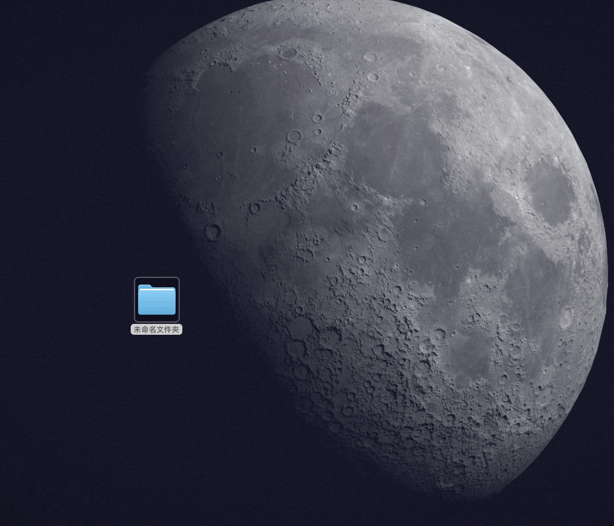

# Wox.Plugin.RImage

Compress selected images in Wox with the bundled [rimage](https://github.com/vlad-salone/rimage) CLI.



## Usage

Select one or more image files, open Wox selection query, then run the RImage result.

# Install

```
wpm install RImage
```
